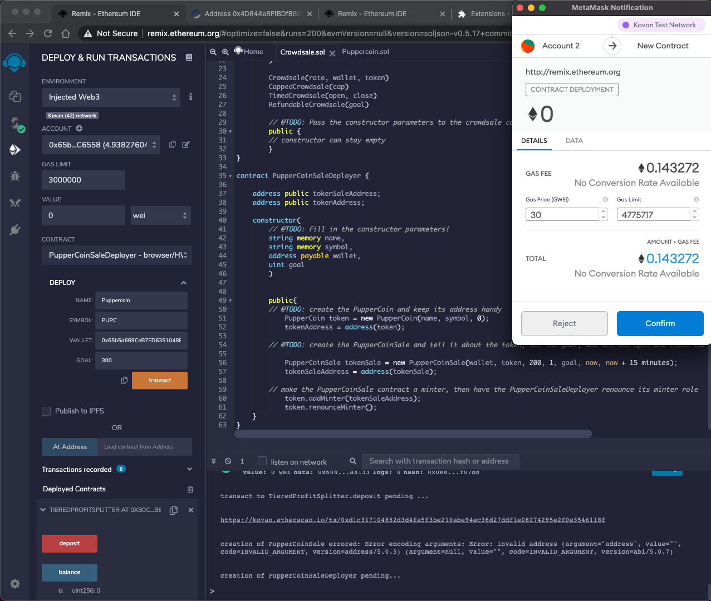
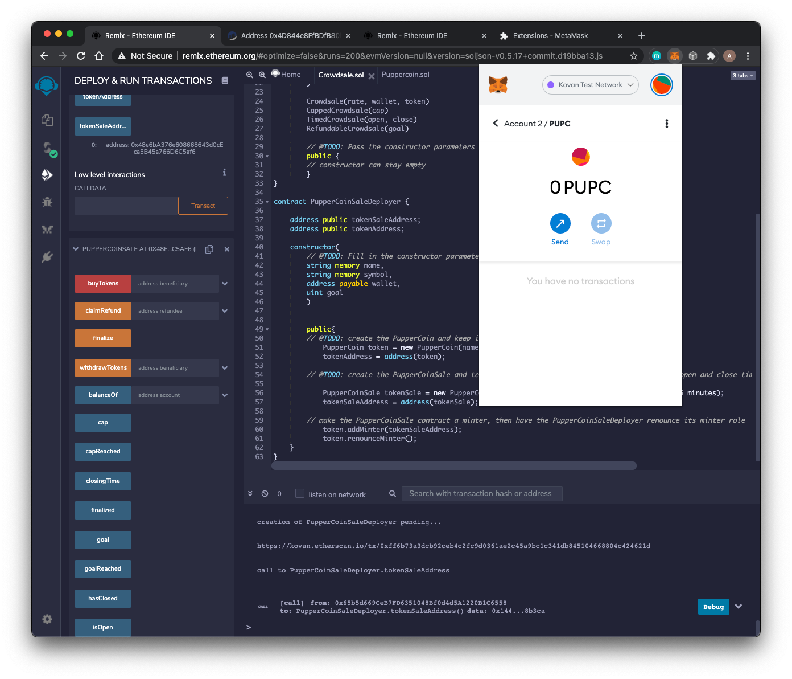

# Puppercoin_Crowdsale

## Overview
Raise funds (max of 300 ETH) through crowdsale of the Puppercoin token.

------
## Software Required

1. [Remix](https://remix.ethereum.org/#optimize=false&runs=200&evmVersion=null&version=soljson-v0.7.4+commit.3f05b770.js) - Webapp

2. [Metamask](chrome://extensions/?id=nkbihfbeogaeaoehlefnkodbefgpgknn) - Google Chrome plugin

3. ETH wallet with test ETH on Kovan or Rospten test network.

----
## Steps to Transact

1. Impost the .sol files into Remix.

2. Compile both the files.

3. Deploy the Crowdsale contract - select the PupperCoinSaleDeployer from the contract dropdown menu and fill in the requirements.

4. Confirm on Metamask.

5. Copy the tokenSaleAddress under Deployed Contracts.

6. Deploy the PupperCoinSale contract under the contracts dropdown pasting in the tokenSaleAddress into the "at address" field.

7. Copy this contract address

8. In Metamask:
    
    1. Under the "Assets" tab select "Add Token"

    2. Select custom token

    3. Paste the PupperCoinSale contract address into the address field.

    4. Give the name, symbol, and decimal places to add the token.

9. You can now transact with the contract using the options under the deployed contracts tab!

------
## Sources
* Header Image - 

* Trilogy Fintech Bootcamp at Rice University

------
## Contributors

* Asif Meghani [LinkedIn](www.linkedin.com/in/asif-meghani-26a2a719)

-----

## License
MIT License

----